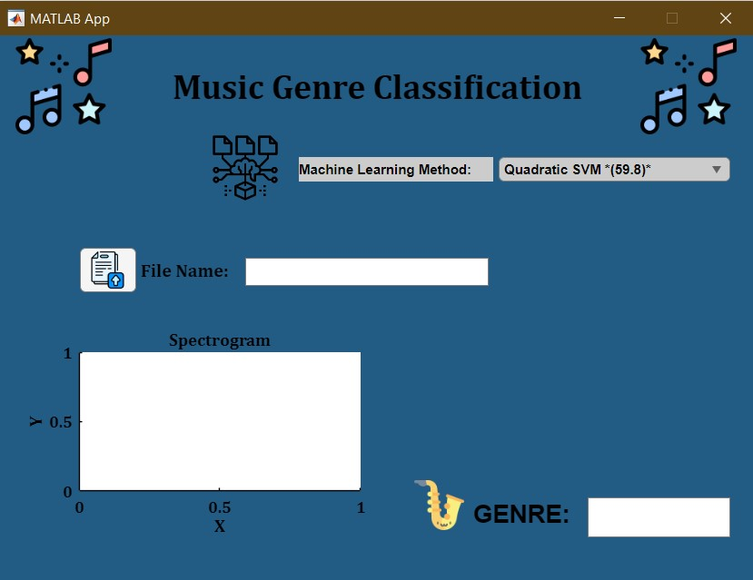
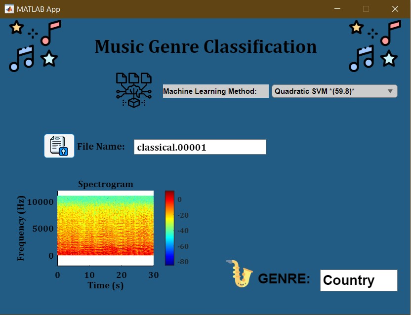

# 🎵 Music Genre Classification using Machine Learning

A project developed for the Signals and Systems course at Düzce University, focusing on classifying music genres using machine learning algorithms and evaluating their performance.

## 📌 Project Overview

In this project, we aimed to classify music genres automatically using machine learning techniques. The GTZAN dataset, a well-known dataset in audio signal processing, was used. It consists of 1000 audio tracks (10 genres × 100 songs), each 30 seconds long.

The main goals were:
- To analyze the performance of different classification algorithms.
- To develop a GUI that allows users to upload music files and classify their genre.

## 🧠 Algorithms Tested

We used MATLAB's **Classification Learner App** to train and evaluate the following algorithms:

- **Decision Trees**: Fine Tree, Medium Tree, Coarse Tree  
- **Support Vector Machines (SVM)**: Linear SVM, Quadratic SVM  
- **K-Nearest Neighbors (KNN)**: Fine KNN, Medium KNN, Coarse KNN  
- **Boosted Trees**
- **Neural Networks**: Narrow Neural Network, Medium Neural Network

### 🔍 Accuracy Comparison

| Algorithm               | Accuracy   |
|------------------------|------------|
| Quadratic SVM          | **59.82%** |
| Linear SVM             | 58.01%     |
| Medium Neural Network  | 55.30%     |
| Narrow Neural Network  | 52.14%     |
| Boosted Trees          | 49.89%     |
| Coarse Tree            | 40.18%     |
| Medium Tree            | 38.83%     |
| Fine KNN               | 38.15%     |
| Fine Tree              | 36.57%     |
| Medium KNN             | 36.34%     |
| Coarse KNN             | **25.06%** |

## 🛠️ Tools & Technologies

- MATLAB & Classification Learner App
- GTZAN Dataset (Blues, Classical, Country, Disco, Hip-Hop, Jazz, Metal, Pop, Reggae, Rock)
- MATLAB App Designer for GUI

## 💻 User Interface

The interface was built using **MATLAB App Designer** and includes:

- File upload functionality
- Dropdown menu for algorithm selection
- Frequency spectrum visualization of the uploaded music
- Display of predicted genre

## 📊 Key Findings

- **Quadratic SVM** showed the highest accuracy.
- **Linear SVM** and **Medium Neural Network** also performed well.
- **Coarse KNN** had the lowest accuracy and needs further improvement.
- Confusion matrices helped analyze misclassifications in detail.

## 🚀 Usage

1. Run the application in MATLAB (via the App Designer environment or by opening the `.mlapp` file).
2. Once the main screen is open, follow these steps:

### 1️⃣ Upload a Music File
- Click the **"Select File"** button to choose a `.wav` music file.
- The name and format of the uploaded file will be displayed on the interface.

### 2️⃣ Select a Classification Algorithm
- Choose a classification algorithm from the dropdown menu:
  - Fine Tree, Medium Tree, Coarse Tree  
  - Linear SVM, Quadratic SVM  
  - Fine KNN, Medium KNN, Coarse KNN  
  - Boosted Trees  
  - Neural Networks (Narrow, Medium)

### 3️⃣ View the Results
- The selected algorithm will classify the music file.
- The predicted genre will be shown in the **GENREEditField** box.
- A **frequency spectrum graph** of the uploaded music will also be displayed for visual analysis.

---

### 🖼️ Application Screenshots

## 👥 Authors

- Mehmet Tat  
- Nebi Erdenay Çubukçu  
- Berkan Öksüz  
- Muhammed Furkan Kuzdağ

**Advisor**: Dr. Osman Akbulut

## 📚 References

- [GTZAN Dataset Paper - IEEE](https://ieeexplore.ieee.org/document/1021072)
- [MATLAB Documentation](https://www.mathworks.com/help/matlab/)
- [Turkish Article on Music Genre Classification](https://dergipark.org.tr/tr/download/article-file/3725383)

---

